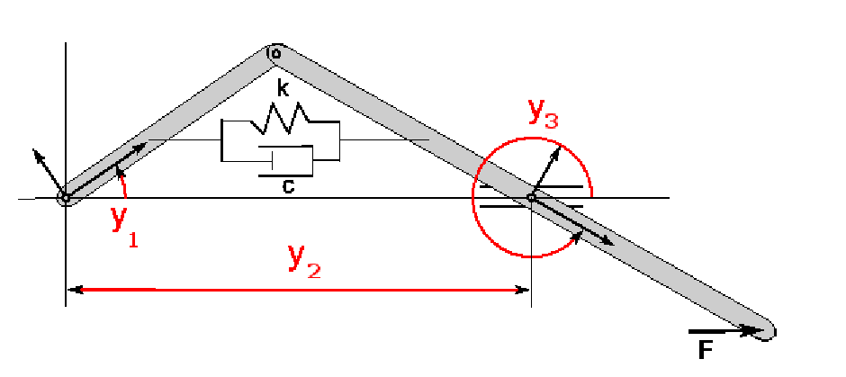

..
   -----------------------------------------------------------------------------
   SUNDIALS Copyright Start
   Copyright (c) 2025-2026, Lawrence Livermore National Security,
   University of Maryland Baltimore County, and the SUNDIALS contributors.
   Copyright (c) 2013-2025, Lawrence Livermore National Security
   and Southern Methodist University.
   Copyright (c) 2002-2013, Lawrence Livermore National Security.
   All rights reserved.

   See the top-level LICENSE and NOTICE files for details.

   SPDX-License-Identifier: BSD-3-Clause
   SUNDIALS Copyright End
   -----------------------------------------------------------------------------

.. _IDAS.Examples.FSA:

Forward Sensitivity Analysis Examples
======================================

For all the IDAS examples, either of the two sensitivity method options,
``IDA_SIMULTANEOUS`` or ``IDA_STAGGERED``, can be used, and sensitivities may
be included in the error test or not (``errconS`` set to ``SUNTRUE`` or
``SUNFALSE``, respectively, in the call to ``IDASetSensErrCon``).

Descriptions of one serial example (``idasSlCrank_FSA_dns``) and one parallel
example (``idasBruss_FSA_kry_bbd_p``) are provided in the following two
subsections. For details on the other examples, the reader is directed to the
comments in their source files.

A serial dense example: idasSlCrank_FSA_dns
--------------------------------------------

To illustrate the use of IDAS in a forward sensitivity analysis (FSA) problem,
using the serial vector representation, we present in this section a problem
from multibody system dynamics. Besides introducing the FSA capabilities of
IDAS, this example also illustrates the proper treatment of such problems within
IDA and IDAS (a stabilized index reduction is required).

The multibody system considered here consists of two bodies (crank and
connecting rod) with a translational-spring-damper (TSD) and a constant force
acting on the connecting rod. The system has a single degree of freedom. It is
modeled with the three generalized coordinates indicated in the figure below
(crank angle, horizontal position of the translational joint, and angle of the
connecting rod) and therefore has two constraints. The local reference frame on
the crank is positioned at the revolute joint on the ground. The crank has
length :math:`a`, mass :math:`m_1`, and moment of inertia :math:`J_1` (with
respect to the local frame). The local reference frame on the connecting rod is
positioned at the translational joint. The connecting rod has length 2, mass
:math:`m_2`, and moment of inertia :math:`J_2`. The TSD has spring constant
:math:`k`, damping constant :math:`c`, and free length :math:`\ell_0`. A
constant horizontal force :math:`F` acts on the connecting rod.

   Slider-crank mechanism modeled with three generalized coordinates.

The equations of motion can be written as

.. math::

   \begin{split}
   M(y) \ddot{y} &= Q(y,\dot{y}) - \Phi_y^T(y) \lambda \\
   \Phi(y) &= 0 \,,
   \end{split}

where :math:`y \in \mathbb{R}^3` is the vector of generalized coordinates,
:math:`M(y)` is the generalized mass matrix, and :math:`Q` is a vector of
generalized applied forces. :math:`\Phi(y) \in \mathbb{R}^2` represents the
(algebraic) position-level constraints and :math:`\Phi_y` is its Jacobian with
respect to :math:`y`. :math:`\lambda \in \mathbb{R}^2` are Lagrange multipliers
corresponding to the constraint forces.

For its solution with IDAS, the above index-3 DAE is reformulated as a
stabilized index-2 DAE (Gear-Gupta-Leimkuhler formulation :cite:p:`GGL:85`) by
introducing two additional Lagrange multipliers :math:`\mu` and appending the
velocity constraints. Converting to first order differential equations, we
obtain:

.. math::
   :label: GGLform

   \begin{split}
   \dot{y} &= v - \Phi_y^T(y) \mu  \\
   M(y) \dot{v} &= Q(y,v) - \Phi_y^T(y) \lambda \\
   \Phi(y) &= 0 \\
   \Phi_y(y) v &= 0 \,,
   \end{split}

where :math:`v = \dot{y}` are the generalized velocities.

For the mechanical system under consideration, the position constraints can be
written as

.. math::

   \Phi(y) = \begin{bmatrix}
   y_2 - a \cos(y_1) - a \cos(y_3) \\
   a \sin(y_1) + \sin(y_3)
   \end{bmatrix}

while the generalized force takes the form

.. math::

   Q(y, v) = \begin{bmatrix}
   - (f/\ell) a [\sin(y_3-y_1)/2 + y_2 \sin(y_1)]/2 \\
   (f/\ell) [\cos(y_3)/2 - y_2 + a \cos(y_1)/2 ] + F \\
   - (f/\ell) [ y_2 \sin(y_3) - a \sin(y_3-y_1)/2]/2 - F \sin(y_3)
   \end{bmatrix} \,,

where

.. math::

   \begin{split}
   f &= k (\ell - \ell_0) + c \ell' \\
   \ell^2 &= y_2^2 - y_2 [\cos(y_3) + a \cos(y_1)] + (1 + a^2)/4 + a \cos(y_3-y_1)/2 \\
   2 \ell \ell' &= 2 y_2 v_2 - v_2 [\cos(y_3) + a \cos(y_1)] + y_2 [\sin(y_3)v_3 + a\sin(y_1)v_1] \\
   & \quad - a \sin(y_3-y_1) (v_3-v_1)/2 \,.
   \end{split}

The generalized mass matrix is diagonal: :math:`M = \mathrm{diag}\{J_1, m_2, J_2\}`.

In the case treated here, :math:`a = 0.5`, :math:`J_1 = 1`, :math:`J_2 = 2`,
:math:`m_1 = m_2 = 1`, :math:`F = 1`, :math:`k = 1`, :math:`c = 1`, and
:math:`\ell_0 = 1`. The final time is :math:`t_f = 10`.

The system :eq:`GGLform` is solved with IDAS using a state vector :math:`Y =
[y, v, \lambda, \mu] \in \mathbb{R}^{10}`. The initial conditions (at :math:`t
= 0`) are set to consistent values, given as follows:

.. math::

   \begin{split}
   y_1 &= \pi/2 \\
   y_3 &= \arcsin(-a) \\
   y_2 &= \cos(y_3) \\
   v_1 &= v_2 = v_3 = 0 \\
   \lambda_1 &= \lambda_2 = \mu_1 = \mu_2 = 0 \\
   dy_1/dt &= dy_2/dt = dy_3/dt = 0 \\
   dv_1/dt &= [Q_1]_{t=0} / J_1 \\
   dv_2/dt &= [Q_2]_{t=0} / m_2 \\
   dv_3/dt &= [Q_3]_{t=0} / J_2 \\
   d\lambda_1/dt &= d\lambda_2/dt = d\mu_1/dt = d\mu_2/dt = 0 \,.
   \end{split}

The problem is solved with a relative tolerance of :math:`10^{-6}` and a
(scalar) absolute tolerance of :math:`10^{-7}`. Note that the algebraic
variables :math:`\lambda` and :math:`\mu` are excluded from the error test (by
specifying them through ``IDASetId`` and invoking ``IDASetSuppressAlg``).

The two parameters of the TSD, :math:`k` and :math:`c`, are considered in a
forward sensitivity analysis of this model. Solution sensitivities with respect
to those parameters are computed and then used to estimate the gradient of the
integrated kinetic energy of the system,

.. math::

   G = \int_{t_0}^{t_f} \left(
   \frac{1}{2} J_1 \dot{y}_1^2 + \frac{1}{2} m_2 \dot{y}_2^2 + \frac{1}{2} J_2 \dot{y}_3^2 \right) \, dt \,.

This is then compared against gradient approximations based on (backward,
forward, and central) finite differences. The sensitivity residuals are
evaluated using the IDAS internal finite-difference approximation. Computation
of the gradient of the integral in :math:`G` takes advantage of the IDAS
feature for computing sensitivities of pure quadrature equations.

The figure below shows the sensitivities of the horizontal position of the
translational joint (:math:`x = y_2`) with respect to the TSD parameters
:math:`k` and :math:`c`, superimposed over the solution itself.

.. figure:: ../../figs_slcrank/x2sensi.png
   :align: center
   :width: 100%

   Sensitivities of the solution component :math:`y_2` with respect to the TSD
   parameters.

The following output is generated by ``idasSlCrank_FSA_dns`` when computing
sensitivities with the ``IDA_SIMULTANEOUS`` method and full error control:

.. literalinclude:: ../../../../examples/idas/serial/idasSlCrank_FSA_dns.out
   :language: none

A parallel example using IDABBDPRE: idasBruss_FSA_kry_bbd_p
------------------------------------------------------------

The ``idasBruss_FSA_kry_bbd_p`` program solves the two-species time-dependent
PDE known as the Brusselator problem, using the :ref:`GMRES iterative linear
solver <SUNLinSol.SPGMR>` and the :ref:`IDABBDPRE preconditioner
<IDAS.Usage.precond.idabbdpre>`.

With subscripts on :math:`u` and :math:`v` denoting partial derivatives, the
PDEs are as follows:

.. math::

   \begin{split}
   \partial u / \partial t &= \epsilon_1 (u_{xx} + u_{yy}) + u^2 v - (B + 1) u + A \\
   \partial v / \partial t &= \epsilon_2 (v_{xx} + v_{yy}) - u^2 v + B u
   \end{split}

on the unit square in :math:`(x,y)`, and for :math:`0 \leq t \leq t_f =
1`. The constants involved are :math:`\epsilon_1 = \epsilon_2 = 0.002`,
:math:`A = 1`, and :math:`B = 3.4`. The boundary conditions are Neumann (zero
derivatives). The initial conditions are given by:

.. math::

   \begin{split}
   u &= 1 - 0.5 \cos(\pi y) \\
   v &= 3.5 - 2.5 \cos(\pi x)
   \end{split}

The PDEs are discretized by central differencing on a uniform 2D spatial
mesh. The boundary conditions are handled by copying values from the first
interior mesh line to a line of ghost values on each side of the square. The
system is actually implemented on submeshes, processor by processor.

Here the forward sensitivity capability in IDAS is used to compute solution
sensitivities with respect to the two parameters :math:`\epsilon_i`. From those,
we compute the corresponding sensitivities of the final spatial average of
:math:`u`,

.. math::

   g = \int \int u(x,y,t_f) \,dx\,dy

by means of a spatial integration of the sensitivities:

.. math::

   \frac{dg}{d\epsilon_i} = \int \int \frac{\partial u(x,y,t_f)}{\partial \epsilon_i}\,dx\,dy \,.

The following output is generated by ``idasBruss_FSA_kry_bbd_p`` when computing
sensitivities with the ``IDA_SIMULTANEOUS`` method and full error control using
the command:

``mpirun -np 4 idasBruss_FSA_kry_bbd_p -sensi sim t``

.. literalinclude:: ../../../../examples/idas/parallel/idasBruss_FSA_kry_bbd_p.out
   :language: none
